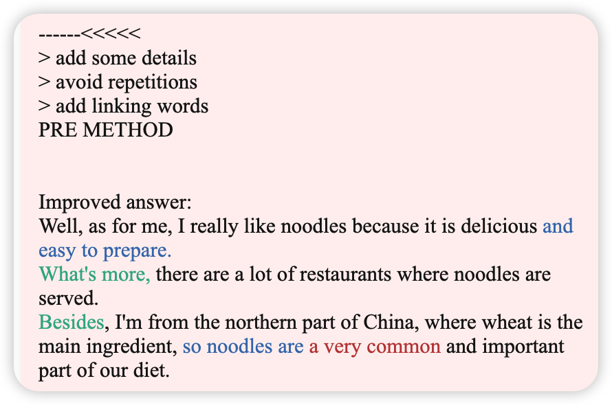
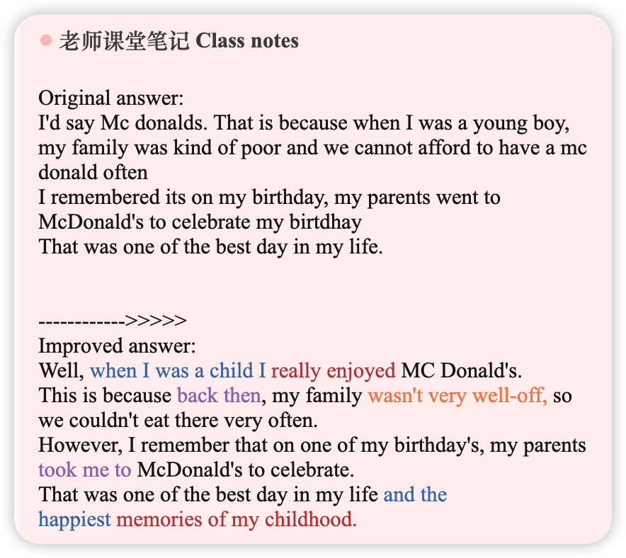
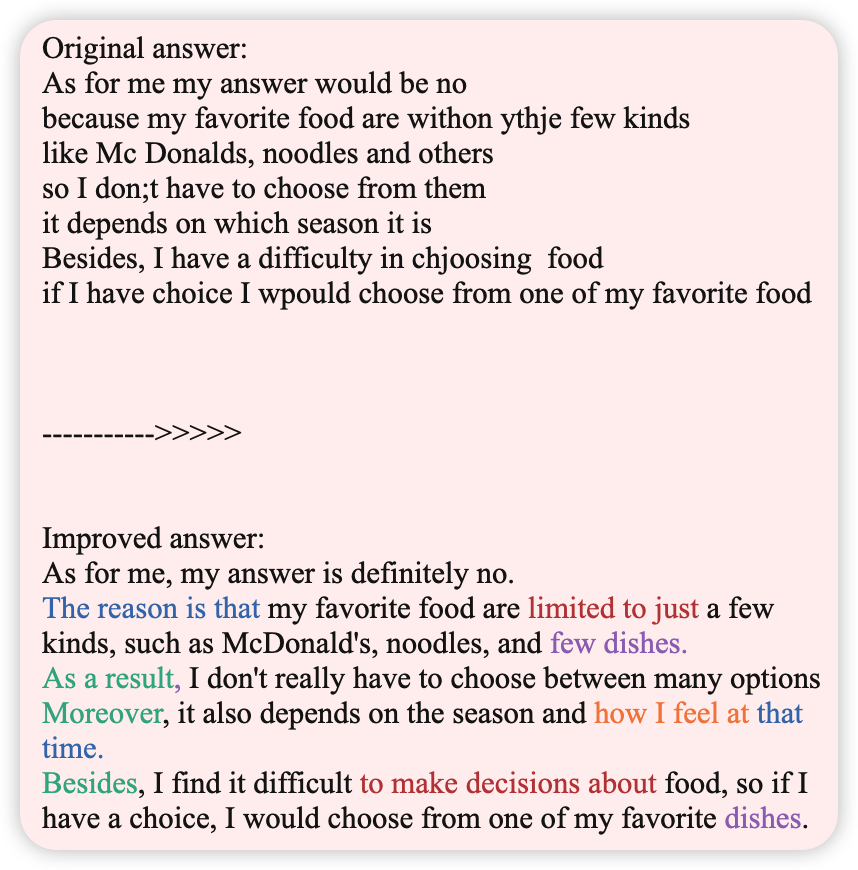
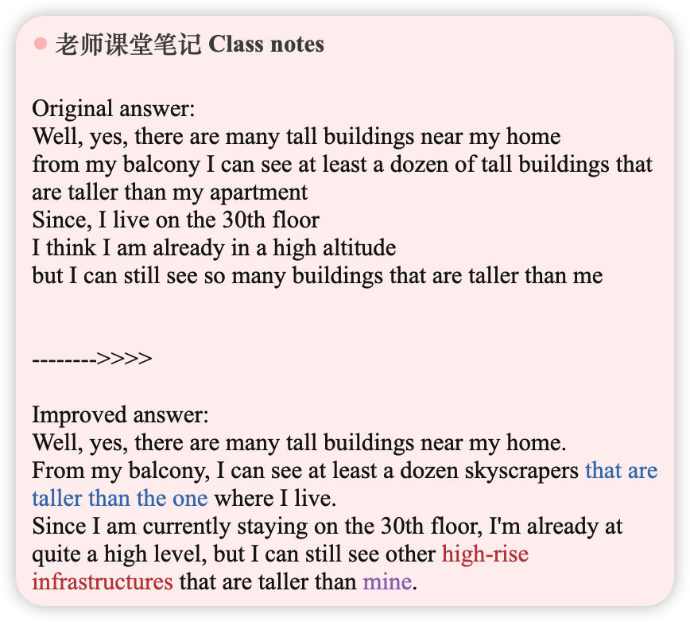
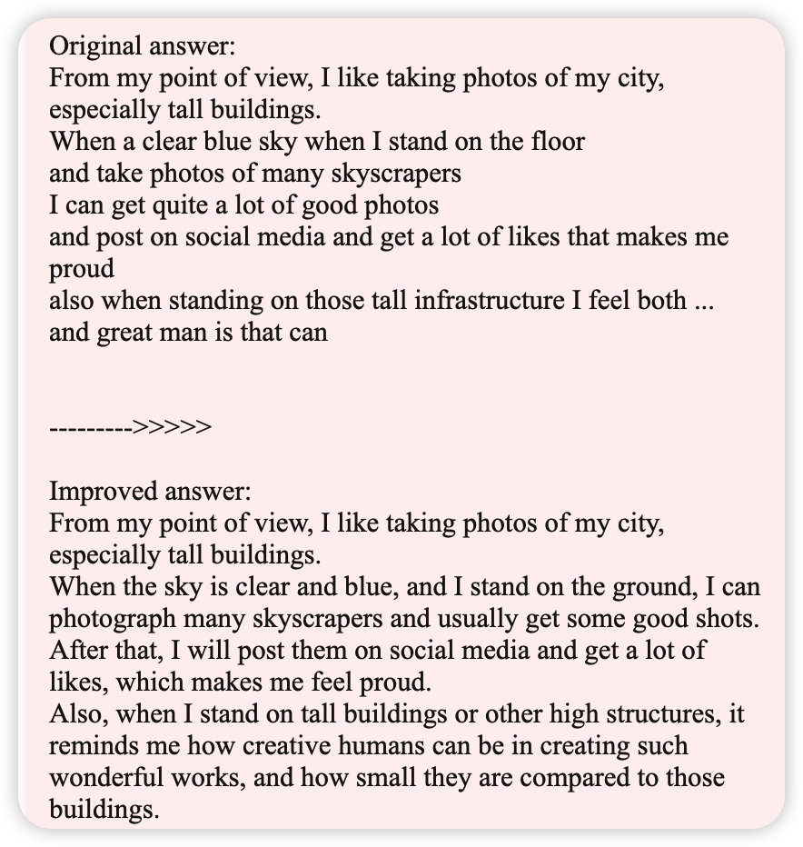

# 2026.01.18 18:00-18:50 体验课

## Do you like getting up early in the morning?

> Like/Dislike 喜好类

Part 1 [N] Morning time

- uhh To be honest, I don't enjoy getting up early in the morning because. uh I often. uh or asleep late in the evening. And if I got up in early in the morning, uh I may have a very difficult day.

===

-- PART 1: PRE Method --- 

- POINT (OPINION), REASON, EXAMPLE. 
- 3 to 4 sentences (30 seconds)
- PART 1 is all about YOU!
- Use PERSONAL EXPERIENCES. 
- Well, to be honest, I don't like getting up early in the morning. This is because I often go to bed late at night, so waking up early makes me feel very tired. For instance, one day I woke up early after sleeping late, and I felt sleepy and had a hard time concentrating all day. 

## Are there any differences between what you do in the morning now and what you did in the past?

> Detail 细节类

- umm... Because umm And preparing for some exams and my work, I umm uh I usually brought some a tech information and and financial information in the morning because I work in this industry. umm This are what I didn't do before.

## Do you spend your mornings doing the same things on both weekends and weekdays? Why?

> Detail 细节类

uhh... my answer, I will be a different because I have, I don't uh have to work in weekends and. um uh So I don't have to prepare for the coming day coming day to with uh um colleagues and my work, so I. uh I may choose to browse some layer information. Maybe some short videos or podcasts? Listen to some podcast are in their weekends.

## Who do you live with?

Part 1 [Essential 必考题] Home/Accommodation

- uhh Currently I'm living all by myself. uhh I'm living alone in this flag. Yes, only me. 

## Would you like to move to a different house/apartment in the future?

uhh Yes, of course, because I'm married and I have a son and we we are not. We did. We don't live together now. We want to live together in the near future.

## What do you think makes a place comfortable to live in?

- umm ... uh... first uhh I guess uhh Enough room is a very important because we don't like to be. uhh Are restricted to a small spaces and secondly, are, if we live with others, we. uh uh One the other to be friendly and not to be. uhh Noisy and like that umm and uh ...

## What's your favorite animal? Why?

Part 1 [N] Pets and Animals

- umm My favorite animal I would I would be cats. Because um uh In the past, I. uh um I used to have two cats and they accompanied me for about a six to seven years and. uh Because we nowadays we are all very busy and don't have much time to work them like working. uh The dogs case don't have need to work, they just stay there and. um uh ... Ignore you.

## Where do you prefer to keep your pet, indoors or outdoors?

Where do you prefer to keep your pet, indoors or outdoors?- uhh Indoors because umm They can be a safe indoors if they are outdoors, there are so many different situations. umm And they may be lost, and and they are free to go anywhere. uh Ii can't leave them in cages.

## What is the most popular animal in China?

What is the most popular animal in China?- uh The most popular of animals in China are, I guess most people would see pandas because they are. uh So cute and they are so ambassador of the of our country, I guess.

## Part 2 [N]Describe an occasion when many people were smiling

You should say:

* When it happened
* Who you were with
* What happened
* And explain why most people were smiling

= uhh I would like to describe a time when many people were smiling in the time when my baby son was born. uhh That was about four years ago and in in the hospital in Shenzhen and most of my family were there. My wife, of course, and my parents and her parents and some other relatives are were all there are waiting for. um uh The new life come to our family. We waited there are for. um uh For a not very long, about half an hour and after that, the doctor opened the door and announced. um uh A baby boy, a baby boy, was born and congratulations and then. um uh All my all, my family members are my parents, her parents and me, we are. We all had a big smile in our faces because that is the. um A smallest, youngest family member of our family and we are all so excited.

## Do you think people who like to smile are more friendly?

 Giving opinions（观点类）

- umm Yes, that's my opinion. Ii think people who tend to smile are. uh um Are more friendly because it's out saying goes you are. uh uh Your all your out characters comes from your inside and if you are so. um uh If you are a smile a lot, that means you have a kind heart. That's a my opinion.

## Why do most people smile in photographs?

 Reasons（原因类）
uhh I guess people smell in photographs because they want to. Capture the uhh um ...A good moment and keep Ah Keep this moment and they don't want to remember this moment. Are are after many years and. uh um And and see uhh Bad face.

## Do women smile more than men? Why?

 Giving opinions（观点类）

uhh As far as I know, yes, we may smell a smile more than man. I don't know why. If I can, I can winter against. umm Because umm We mean they play a different part, a different role in a family and in Ah Husband and wife relationships, and in most occasions women's are those are those who are. uh Raisechildren and they are uh That's why they should keep a big smile on their face and to be. uh Kind and friendly.

## Do people smile more when they are younger or older?

 Giving opinions（观点类）
umm In my opinion, people smile more when they are younger and old, saying goes, are children have. uh More innocent smells are and when they are grow order they are not. They become no longer innocent and they are to cope with all kinds of society occasion, social occasions. uhh Sometimes they have to put fake smiles and that's not what they mean in the heart.

==== -- PART 3: PREC METHOD ---

- POINT (OPINION), 2 REASONS, 2 EXAMPLES, CONCLUSION. - 40 seconds to 1 min 
- AVOID using PERSONAL EXPERIENCES. (EX: I, Me, My, etc.)
- PART 3 focuses more on SOCIETY & PEOPLE. 
- Use GENERAL TERMS & IDEAS. (EX: Someone, the people, etc.)

POINT (Opinion): Well, from my point of view, people smile more when they are younger. 

REASONS: One factor is that children are more innocent and carefree, so their smiles are natural and frequent. On the other hand, as people grow older, they face responsibilities and social pressure, which sometimes require being polite or put fake smiles rather than genuine ones. 

EXAMPLES: For instance, young children often smile while playing or spending time with friends without worrying about anything. In contrast, adults have many things to worry about, like salaries, jobs, their children's education, or their parents' health. 

CONCLUSION: Overall, people tend to smile more genuinely when they are young, while adults' smiles are often influenced by responsibilities and life pressures. 

# 2026.01.21 19:30-20:20 话题练习 2

## What is your favourite food?

> Like/Dislike 喜好类

Original answer:My favorite food is noodles because there are so many kind of delicious noodles inChina i am from the nirthern part of China where the main dishes are made from wheat and noodles is one of that kind of food

------<<<<<

> add some details 

> avoid repetitions 

> add linking words

PRE METHOD

Improved answer: Well, as for me, I really like noodles because it is delicious and easy to prepare. What's more, there are a lot of restaurants where noodles are served. Besides, I'm from the northern part of China, where wheat is the main ingredient, so noodles are a very common and important part of our diet. 

## What kind of food did you like when you were young?

> Detail 细节类

Original answer:I'd say Mc donalds. That is because when I was a young boy, my family was kind of poor and we cannot afford to have a mc donald often I remembered its on my birthday, my parents went to McDonald's to celebrate my birtdhay That was one of the best day in my life.

------------>>>>>

Improved answer: Well, when I was a child I really enjoyed MC Donald's. This is because back then, my family wasn't very well-off, so we couldn't eat there very often. However, I remember that on one of my birthday's, my parents took me to McDonald's to celebrate. That was one of the best day in my life and the happiest memories of my childhood. 

## Do you eat different foods at different times of the year?

> Detail 细节类

Original answer:As for me my answer would be no because my favorite food are withon ythje few kinds like Mc Donalds, noodles and others so I don;t have to choose from them it depends on which season it is Besides, I have a difficulty in chjoosing food if I have choice I wpould choose from one of my favorite food

----------->>>>>

Improved answer: As for me, my answer is definitely no. The reason is that my favorite food are limited to just a few kinds, such as McDonald's, noodles, and few dishes. As a result, I don't really have to choose between many options Moreover, it also depends on the season and how I feel at that time. Besides, I find it difficult to make decisions about food, so if I have a choice, I would choose from one of my favorite dishes. 

## Has your favourite food changed since you were a child?

> Past experience 经历类

Original answer:My answer would no.Since noodles are always my favorite kind of food I never had enough of it Nowadays, when I ahe to choose what to eat, My first option would noodles on weekends or hilidays I would also make noodles for myself

------->>>>

Improved answer: Well, I would say that my taste in food is still the same.Noodles have always been my favorite kind of food, and I can't get enough of them.Nowadays, when I have to choose what to eat, it is usually my first choice. Even on weekends or holidays, I would make them for myself at home. 

## Are there tall buildings near your home?

> Detail 细节类

Original answer:Well, yes, there are many tall buildings near my home from my balcony I can see at least a dozen of tall buildings that are taller than my apartment Since, I live on the 30th floor I think I am already in a high altitude but I can still see so many buildings that are taller than me

-------->>>>

Improved answer: Well, yes, there are many tall buildings near my home. From my balcony, I can see at least a dozen skyscrapers that are taller than the one where I live.Since I am currently staying on the 30th floor, I'm already at quite a high level, but I can still see other high-rise infrastructures that are taller than mine. 

## Do you take photos of buildings?

> Like/Dislike 喜好类

Original answer:From my point of view, I like taking photos of my city, especially tall buildings.When a clear blue sky when I stand on the floor and take photos of many skyscrapers I can get quite a lot of good photos and post on social media and get a lot of likes that makes me proud also when standing on those tall infrastructure I feel both ... and great man is that can 

--------->>>>> 

Improved answer: From my point of view, I like taking photos of my city, especially tall buildings.When the sky is clear and blue, and I stand on the ground, I can photograph many skyscrapers and usually get some good shots. After that, I will post them on social media and get a lot of likes, which makes me feel proud. Also, when I stand on tall buildings or other high structures, it reminds me how creative humans can be in creating such wonderful works, and how small they are compared to those buildings. 

---

Try to practice answering Part 2 Questions.

Variety of sentences

Most of the time, I find my work a bit boring and repetitive. l attend meetings almost every day. Because of this, I don't have enough time to write all the codes that I need to accomplish within the deadline. Thus, l often work overtime to compensate for the time lost spent in meetings.

First, one should learn to use at least one programming languages such as PHP or Golang. Also, one should also need to adapt to use servers and databases. Last but not least, one should have enough knowledge on the financial industry.

Five years is a long time. I have worked in this company for about five years. If l had the chance, I may stay in this company for another five years. I love this job, and l am willing to improve my knowledge in writing codes and financial knowledge.

---
